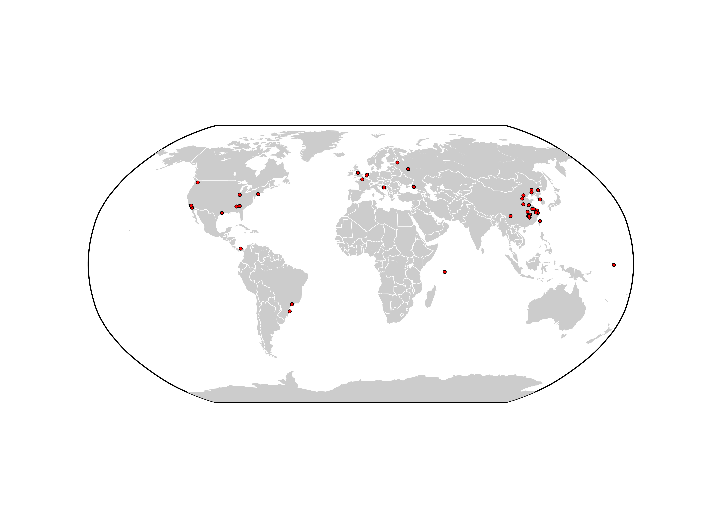

# ip-location-map

Here are some python scripts you can use to plot ip-addresses on a map

### Dependencies:

* [matplotlib basemap](http://matplotlib.org/basemap/)
* [pyipinfodb](https://github.com/mossberg/pyipinfodb)

### Short usage guide:

* First, you need to get an API key for [ipinfodb](http://ipinfodb.com/), and insert it in **getlocation.py**.

* Finally, run the **getlocation.py** script. It will create an image file called map.png.

### Map

Resulting map

